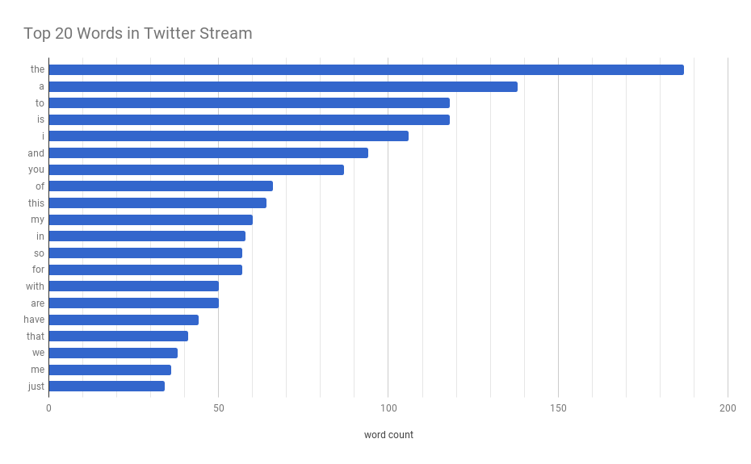

# Twitter Stream Word Counter
#### Architecture and Running Application
Noah Randolph
11 Dec. 2017

* application idea  
* description of the architecture  
* directory and file structure  
* file dependencies and running the application  

### Application Idea
Displays user-specified word counts obtained from all tweets during a user-specified amount of time. The user has 3 options for reporting word counts: 1. Get total counts of a single user-specified word; 2. Get an alphabetized list of all words gathered from stream and the number of times each word occurred; 3. Get a list of all words that occurred between x1 and x2 number of occurences, inclusive, where x1 is a lower limit integer and x2 is an upper limit integer.

### Description of the Architecture
An application created at https://apps.twitter.com/ provides access to all tweets after confirming credentials. Three spout components (defined in tweets.py) read tweets using the [Tweepy](http://www.tweepy.org/) library. The tweets are then processed by a parsing bolt that splits tweets into separate words and removes several symbols in order to have a clearer count of unique words. From that bolt, the stream of processed words are further processed by a bolt that connects to the Postgres database “tcount” and adds or updates words with new counts in the table “tweetwordcount.”

The spouts and bolts described are replicated in the “extweetwordcount.clj” Clojure script in the “extweetwordcount” Streamparse project. The spout is replicated 3 times, the parsing bolt 3 times, and the counting bolt 2 times.

Feed from the Twitter stream continues until the user decides to end it, after which reporting is available through two different Python scripts. The script “finalresults.py” will report an alphabetized list of all words from the Postgres table “tweetwordcount” along with the total amount that each word occurred in the Twitter stream. The user has the option to include a specific word as a command line argument when running the script, in which case only the total occurrences of that word are reported. The script “histogram.py” is run with the user including a command line argument that specifies a lower and upper bound of total word counts. The script will return a list of words with counts in between the given lower and upper bounds, including the values of the bounds themselves.

### Directory and File Structure
* Top level  
    + finalresults.py: Python script for reporting word counts  
    + histogram.py: Python script for reporting word counts  
    + extweetwordcount: directory of Streamparse project  
        - topologies: directory containing the Clojure script  
            + tweetwordcount.clj: defines structure of streaming application (AKA topology), including spouts and bolts  
        - src: directory of spouts and bolts referred to in Clojure script  
            + spouts: directory of spouts  
                - tweets.py: contains the Tweets class that gains authorization for access to Twitter stream  
            + bolts: directory of bolts  
                - parse.py: splits tweets into words and removes symbols  
                - wordcount.py: adds new words or updates count of word occurrences in Postgres table “tweetwordcount”  
        - logs: directory of .log files of each node in the topology, identified by a process ID  
        - other files created and utilized by the Streamparse project  

### File Dependencies
The file structure must be in the format shown above. Postgres should be running, with the database “tcount” and table “tweetwordcount” that has a column for words and a column for counts already present. Streamparse should be installed.

The [Psycopg](http://initd.org/) database adaptor and [Tweepy](http://www.tweepy.org/) library must be installed for Python to access Postgres and for accessing the Twitter API from Python.

### Running the Application
1. Navigate down to the “extweetwordcount” directory by entering “cd extweetwordcount”. This is the directory of the Streamparse project.
2. At the command line, enter “sparse run.”
3. Wait while the Twitter stream is accessed. After a brief period, a stream of words processed by the topology will scroll up the command line interface.
4. Allow a few moments for the stream to run. The database is gathering new words and word counts.
5. Enter “control” + “c” to stop the stream.
6. Navigate back up to the top level by entering “cd ..”
7. Enter “ls -l” and verify you are in the correct directory. You should see the the files “finalresults.py” and “histogram.py.”
8. Get an alphabetized list of all the words streamed by entering “python finalresults.py” in the command line.
9. Get the total counts of a word of your choosing by entering “python finalresults.py [word of your choosing]”
10. Get the words with counts between numbers of your choosing by entering “python histogram.py [x1],[x2]” where [x1] is a lower bound integer and [x2] is an upper bound integer. 

(The longer the process is allowed to run in step 8, the more words will result.)

